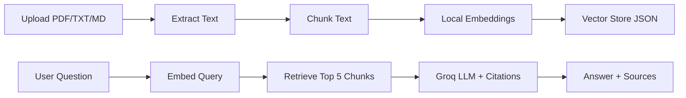

# DocMind — RAG Document Q&A

DocMind is a portfolio-ready **Retrieval-Augmented Generation (RAG)** app built with **Next.js** and **Groq**. Upload PDF, TXT, or Markdown files, ask questions in natural language, and get answers grounded in your documents with source citations.

## Features

- PDF, TXT, and Markdown ingestion
- Text chunking + **local embeddings** (free, runs on your machine)
- Cosine similarity search over a local vector store
- **Groq** LLM answers with citation-backed prompts
- Modern Next.js App Router UI with Tailwind CSS

## Architecture



## Tech Stack

| Layer | Technology |
|-------|------------|
| Frontend | Next.js 16, React 19, Tailwind CSS |
| LLM | Groq (`llama-3.1-8b-instant`) |
| Embeddings | Local `Xenova/all-MiniLM-L6-v2` (free) |
| PDF parsing | pdf-parse |
| Storage | Local JSON vector store (`data/vector-store.json`) |

## Getting Started

### 1. Prerequisites

- Node.js 20.16+ recommended
- A free [Groq API key](https://console.groq.com/keys)

### 2. Install dependencies

```bash
cd docmind
npm install
```

### 3. Configure environment

```bash
cp .env.example .env.local
```

Add your Groq API key to `.env.local`:

```
GROQ_API_KEY=gsk_...
GROQ_CHAT_MODEL=llama-3.1-8b-instant
```

Get a free key at https://console.groq.com/keys

### 4. Run the dev server

```bash
npm run dev
```

Open [http://localhost:3000](http://localhost:3000).

### 5. Try it

1. Upload `data/sample_docs/sample.md` (or any PDF)
2. Ask: *"What is DocMind and how does RAG work?"*
3. Expand the source citations under the answer

**Note:** The first upload may take a minute while the embedding model downloads (~90MB). After that it is cached locally.

If you previously used OpenAI, delete `data/vector-store.json` and re-upload your documents.

## Project Structure

```
src/
├── app/
│   ├── api/
│   │   ├── upload/route.ts    # Document ingestion
│   │   ├── chat/route.ts      # Q&A endpoint
│   │   └── documents/route.ts # List uploaded docs
│   └── page.tsx
├── components/
│   └── ChatApp.tsx            # Main UI
└── lib/
    ├── ingest.ts              # PDF/text extraction + indexing
    ├── rag.ts                 # Retrieval + generation
    ├── embeddings.ts          # Local embeddings
    ├── groq.ts                # Groq chat client
    ├── vector-store.ts        # Similarity search
    ├── chunking.ts            # Text chunking
    └── prompts.ts             # System prompts
```

## API Endpoints

| Method | Path | Description |
|--------|------|-------------|
| `POST` | `/api/upload` | Upload a document (multipart form, field: `file`) |
| `POST` | `/api/chat` | Ask a question (`{ "question": "..." }`) |
| `GET` | `/api/documents` | List indexed documents |

## CV Bullet Points

- Built a RAG document Q&A system with Next.js and Groq, featuring PDF ingestion, local embedding-based retrieval, and citation-backed answers.
- Implemented a full-stack AI pipeline: chunking, vector search, prompt engineering, and REST API endpoints — with zero paid LLM cost for embeddings.
- Designed a clean demo UI for uploading documents and chatting with source-level transparency.

## License

MIT
